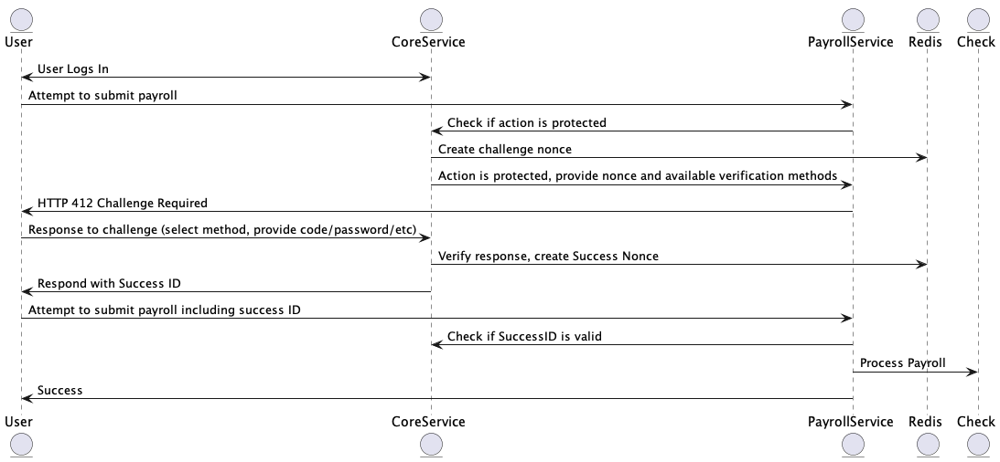

Challenging Protected Resources
===============================

This document outlines the basic process for requiring elevated security in order to access a protected resource, or invoke a protected action.

## Outline
[UML Disagram for Challenge](./schallenge.plantuml)

