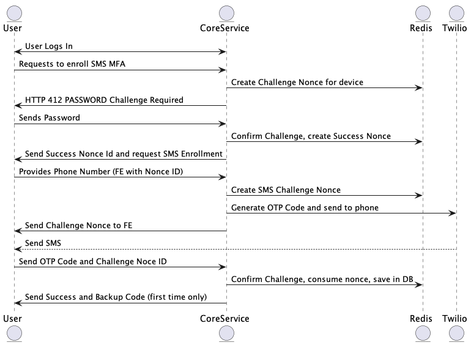

Multi-Factor Authentication Enrollment
======================================

Enrollment is the process of setting up and configuring a new MFA method.

**Currently Supported**
- SMS
- Password _(only supported for logging in if all other methods are forgotton)_
- Backup Code _(only supported for resetting another MFA)_

**Planned**
- Mobile Authenticator App _(like Authy, Google Authenticator, etc)_
- U2F _(USB Security Key like YubiKey)_

# First Time Enrollment

## The BACKUP Code

The very first time a user opts to enroll in MFA, a `BACKUP` code will be generated, and it will be displayed at the conclusion of the MFA enrollment.

Only the encrypted version of the `BACKUP` code is stored in the database. The `BACKUP` code is only displayed once, and is never stored in plaintext.  Regenerating a code is itself
a protected action requiring passing an MFA challenge (like a password.)

## SMS Enrollment

[UML Disagram for SMS Enrollment](./sms-enrollment.plantuml)

