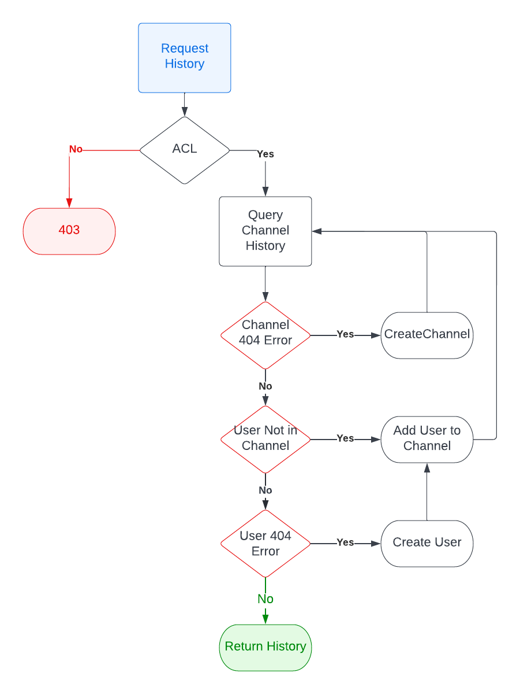

Fetching Conversation History
=============================
Fetching the history of a conversation returns a paginated set of messages.

| Parameter   | Type | Required | Description                                                                                                                         |
| ----------- | ---- | -------- | ----------------------------------------------------------------------------------------------------------------------------------- |
| **recipientId** | `String` | Yes      | Used to determine the one-on-on channel.  The `channel_url` is constructed using the `CurrentUser`'s `userId` and the `recipientId` |
| *afterMessageId* | `long|Number` | No | When provided, fetches a page of messages older than this messageId |

## Process
- Check the CASL rules to determine if the `CurrentUser` can `read-history` against the `recipientId`.
- Request history from [`🔗 UserChatService`](../../services/user-chat.service.ts)
- [`🔗 UserChatService`](../../services/user-chat.service.ts) will interact with the repository layer as follows:
  - Attempt to get History
  - If there is a "Channel Not Found" error, create the channel and attempt to get History
  - If there is a "User Not In Channel" error, add the user to the channel, and attempt to get History.
  - If there is a "User Not Found" error, create the user, add the user to the channel, and attempt to get History.

## Authorization
For a one-on-one conversation:
**EE**
- An EE can only view chat history with their direct manager.

**EM**
- A Manager can view chat history with any of their direct reports.

**Owner/Admin**
- Not Currently defined

## Flowchart

