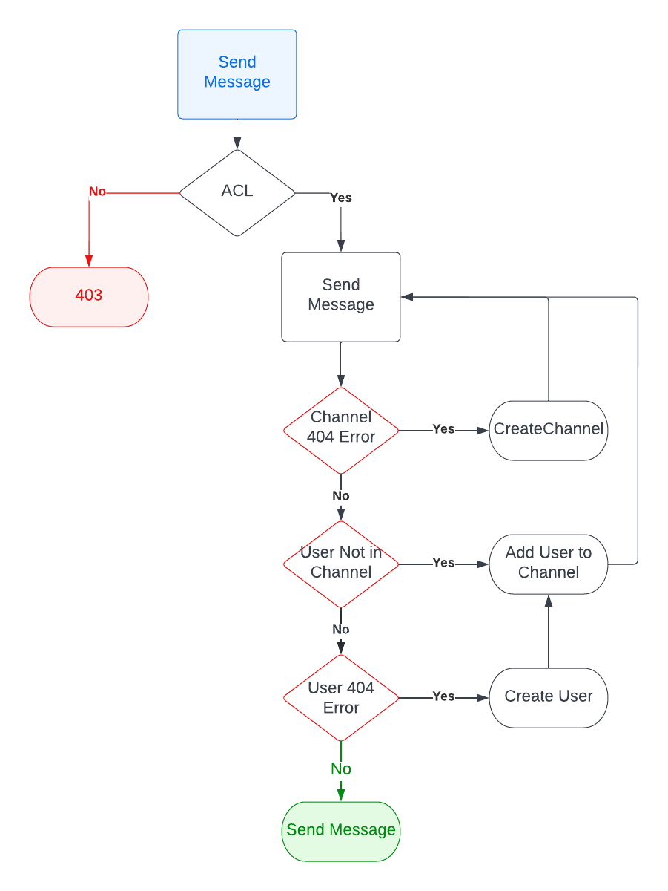

Sending a One-on-One message
=============================

| Parameter       | Type     | Required | Description                                                                                                                         |
| --------------- | -------- | -------- | ----------------------------------------------------------------------------------------------------------------------------------- |
| **recipientId** | `String` | Yes      | Used to determine the one-on-on channel.  The `channel_url` is constructed using the `CurrentUser`'s `userId` and the `recipientId` |
| **message**     | `String` | Yes      | The message content                                                                                                                 |

## Process
- Check the CASL rules to determine if the `CurrentUser` can `send-message` against the `recipientId`.
- Send a messade through [`🔗 UserChatService`](../../services/user-chat.service.ts)
- [`🔗 UserChatService`](../../services/user-chat.service.ts) will interact with the repository layer as follows:
  - Attempt to Send Message
  - If there is a "Channel Not Found" error, create the channel and attempt to send the message.
  - If there is a "User Not In Channel" error, add the user to the channel, and attempt to send the message.
  - If there is a "User Not Found" error, create the user, add the user to the channel, and attempt to send the message.
  - Return the message payload.

## Authorization
For a one-on-one conversation:
**EE**
- An EE can send a message to their direct manager.

**EM**
- A Manager can send a message to any of their direct reports.

**Owner/Admin**
- Not Currently defined

## Flowchart

